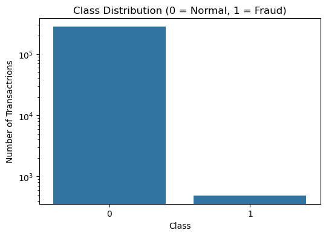
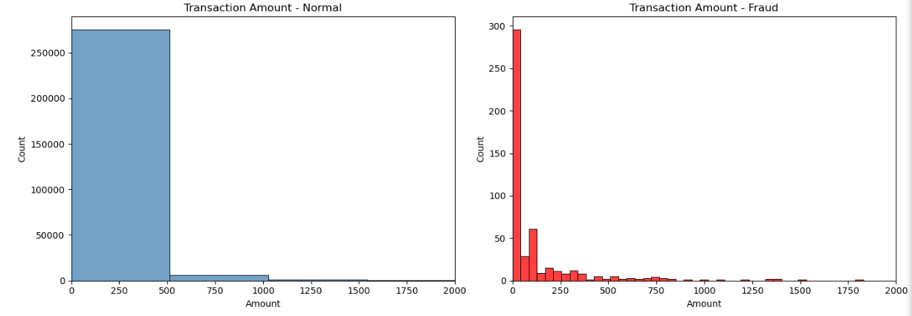
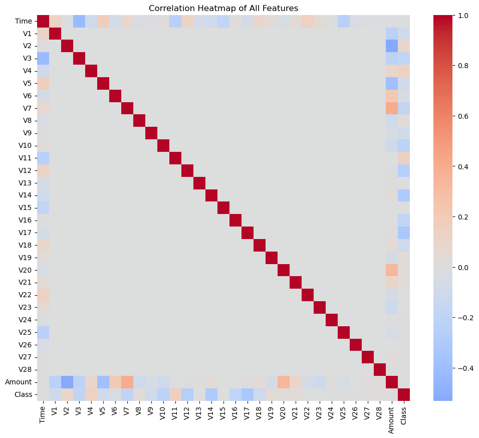
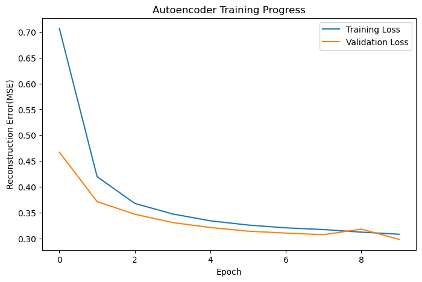

# Credit Card Fraud Detection Project
##Project Overview

This project investigates the use of unsupervised anomaly machine learning techniques for credit card fraud detection. Due to how rare frauds cases are, the models were trained withoutusing fraud labels and were assessed on their ability to identify anomalous transactions.

The models that were implement and compared are:
- Isolation Forest
- One-Class SVM
- Autoencoder

##Dataset

The Project uses the Credit Card Fraud Detection dataset that is available on kaggle:
https://www.kaggle.com/datasets/mlg-ulb/creditcardfraud

##Running Process
1. Install dependencies: pip install -r requirement.txt
2. Open the ipynb notebook
3. Run all cells

##Result Summary
| Model | Precision | Recall | F1-Score | ROC-AUC |
|---|---|---|---|---|
| Tune Isolation Forest | 0.3077 | 0.3265 | 0.3168 | 0.9536 |
| One-Class-SVM | 0.0266 | 0.8878 | 0.0517 | 0.9451 |
| Autoencoder | 0.5052 | 0.5000 | 0.5026 | 0.9705 |

##Dataset Distribution

##Normal vs Fraud Transactions

##Feature Correlation Heatmap

##Autoencoder Traininf Loss

#Requirements

see requirements.txt

